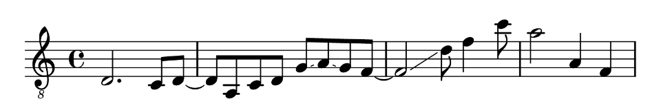
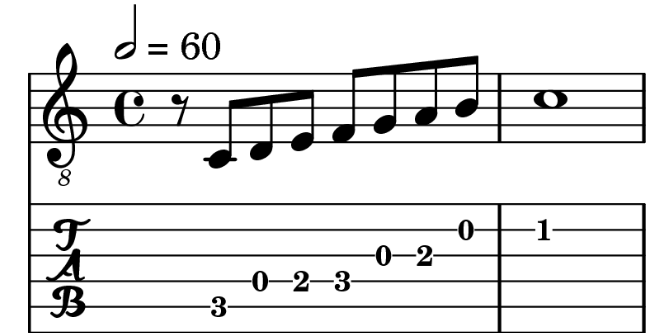

<!-- README.md is generated from README.Rmd. Please edit that file -->

# tabr 



<!-- badges: start -->

[](https://www.repostatus.org/)
[](https://github.com/leonawicz/tabr/actions/workflows/R-CMD-check.yaml)
[](https://app.codecov.io/gh/leonawicz/tabr?branch=master)
[](https://cran.r-project.org/package=tabr)
[](https://cran.r-project.org/package=tabr)
[](https://github.com/leonawicz/tabr)
<!-- badges: end -->

## Overview

The `tabr` package provides a music notation syntax and a collection of
music programming functions for generating, manipulating, organizing and
analyzing musical information in R.

The music notation framework facilitates creating and analyzing music
data in notation form; i.e, more from the perspective and in the
language of a musician than, say, an audio engineer.

## Citation

Matthew Leonawicz (2023). tabr: Music Notation Syntax, Manipulation,
Analysis and Transcription in R. R package version 0.4.9.
<https://CRAN.R-project.org/package=tabr>

## Contribute

Contributions are welcome. Contribute through GitHub via pull request.
Please create an issue first if it is regarding any substantive feature
add or change.

## Installation

Install the CRAN release of `tabr` with

``` r
install.packages("tabr")
```

Install the development version from GitHub with

``` r
# install.packages("remotes")
remotes::install_github("leonawicz/tabr")
```

## Motivating example

``` r
as_music("r8 c d e f g a b c'1") |> plot_music_guitar()
```



## Music data structures

It’s easiest to begin with a high level view using some basic examples.

Music data can be viewed, manipulated and analyzed while in different
forms of representation based around different data structures: strings
and data frames. Each representation offers advantages over the other
for different use cases.

Music syntax can be entered directly and represented in character
strings to minimize the formatting overhead of data entry by using
simple data structures, for example when wanting to quickly enter and
transcribe short pieces of music syntax in R into sheet music or
tablature files. You can also enter sound and time together with the
`music` class, and no need to repeat consecutive durations until a
change.

Here is an example of making a string of pitches *noteworthy* and a
string of combined pitch and duration into a music object. Such objects
carry various musical information based on the syntax of an input
string.

``` r
library(tabr)

x <- "a, c e g# a ac'e' ac'e'~ ac'e' a c' e' a'"
x <- as_noteworthy(x)
x
#> <Noteworthy string>
#>   Format: space-delimited time
#>   Values: a, c e g# a <ac'e'> <ac'e'~> <ac'e'> a c' e' a'

summary(x)
#> <Noteworthy string>
#>   Timesteps: 12 (9 notes, 3 chords)
#>   Octaves: tick
#>   Accidentals: sharp
#>   Format: space-delimited time
#>   Values: a, c e g# a <ac'e'> <ac'e'~> <ac'e'> a c' e' a'

y <- "a,8 c et8 g# a ac'e'4. ac'e'~8 ac'e'4 at4 c' e' a'1"
y <- as_music(y)
summary(y)
#> <Music string>
#>   Timesteps: 12 (9 notes, 3 chords)
#>   Octaves: tick
#>   Accidentals: sharp
#>   Key signature: c
#>   Time signature: 4/4
#>   Tempo: 2 = 60
#>   Lyrics: NA
#>   Format: space-delimited time
#>   Values: a,8 c8 et8 g#t8 at8 <ac'e'>4. <ac'e'~>8 <ac'e'>4 at4 c't4 e't4 a'1

music_split(y)
#> $notes
#> <Noteworthy string>
#>   Format: space-delimited time
#>   Values: a, c e g# a <ac'e'> <ac'e'~> <ac'e'> a c' e' a'
#> 
#> $info
#> <Note info string>
#>   Format: space-delimited time
#>   Values: 8 8 t8 t8 t8 4. 8 4 t4 t4 t4 1
#> 
#> $lyrics
#> [1] NA
#> 
#> $key
#> [1] "c"
#> 
#> $time
#> [1] "4/4"
#> 
#> $tempo
#> [1] "2 = 60"
```

Functions exist for directly performing various mathematical, logical
and organizational operations and musical transformations on strings
like the one above by checking their music syntax validity and adding
custom classes and methods to these strings (more on this below). `tabr`
offers special object classes that facilitate working with music data
and notation in ways that are natural to R, robust, tidy, and lend
themselves well to transcription as well as analysis.

Of course, none of this will work on character strings that are not
“noteworthy” or “musical”, for example. Invalid, unworthy syntax is
rejected early with an error, preventing corrupted music syntax from
causing unexpected issues later on.

The same music data can also be organized in tidy data frames, allowing
for a more familiar and powerful approach to the analysis of large
amounts of structured music data.

``` r
x <- "a,8 c e r r c a, g#, a ac'e'"
as_music(x) |> as_music_df()
#> # A tibble: 10 × 14
#>    duration pitch note  semitone octave  freq pitch_int scale_int slur  slide
#>    <chr>    <chr> <chr>    <int>  <int> <dbl>     <int> <chr>     <chr> <lgl>
#>  1 8        a,    a           57      2  110.        NA <NA>      <NA>  FALSE
#>  2 8        c     c           48      3  131.         3 m3        <NA>  FALSE
#>  3 8        e     e           52      3  165.         4 M3        <NA>  FALSE
#>  4 8        r     r           NA     NA   NA         NA <NA>      <NA>  FALSE
#>  5 8        r     r           NA     NA   NA         NA <NA>      <NA>  FALSE
#>  6 8        c     c           48      3  131.        -4 M3        <NA>  FALSE
#>  7 8        a,    a           57      2  110.        -3 m3        <NA>  FALSE
#>  8 8        g#,   g#          56      2  104.        -1 m2        <NA>  FALSE
#>  9 8        a     a           57      3  220         13 m9        <NA>  FALSE
#> 10 8        ac'e' ace         57      3  220          0 P1        <NA>  FALSE
#> # ℹ 4 more variables: bend <lgl>, dotted <int>, articulation <chr>,
#> #   annotation <chr>
```

Several functions are available for mapping seamlessly between and
manipulating these data structures and their representations of musical
information.

## Noteworthy strings

It is helpful to have a deeper understanding of how this music notation
syntax informs data structures and operations integrated throughout the
package.

As a quick introduction and to get oriented to the music notation syntax
offered by `tabr`, consider the concept of a noteworthy string. This is
like any other character string, except that what makes a string
noteworthy is that its content consists strictly of valid `tabr` music
notation syntax. It can be parsed unambiguously and meaningfully as
input by package functions that inspect and manipulate musical
information.

### A bit about basic syntax

A simple character string like `"c e g"`, or alternatively as a vector,
`c("c", "e", "g")`, is a noteworthy string. The single lowercase letter
`"a"` is noteworthy. So are `"a_"` and `"a#"` (flat and sharp). However,
`"A"` is not (case sensitivity), nor is `"z"`. Of course, as seen above,
there is more valid syntax than just the lowercase musical note letters
`a` through `g` and sharp and flat notation.

An important piece of syntax is the octave. In conjunction with a note,
specifying a unique pitch requires the octave number, either in tick
format (comma and single quote, `c, c c'`) or integer format
(`c2 c c4`). Octave 3 is the implicit default; there is no tick in tick
format and explicitly adding the `3` in integer format is unnecessary.
The pitches `c d e f g a b` (default octave) are the notes in the octave
below middle C (`c'`).

You’ve already seen above with the example using a music object that a
noteworthy string can be one part of a more complete piece of musical
information. Tick format is necessary to avoid ambiguity with respect to
temporal information once two such pieces of information are merged
together. For this reason, tick format is preferred in general. Tick
format also matches that used by the LilyPond music engraving software,
which is used by the `tabr` LilyPond API for anything transcription
related like rendering sheet music to PDF or in R markdown documents.

For all available syntax specifications and related details see the
package vignettes.

### The noteworthy class

Noteworthiness can be checked on any character string. When defining
noteworthy strings you can define them like any other character vector.
However, you will notice that package functions that operate on
noteworthy strings and whose output is another noteworthy string will
yield a string with the supplemental `noteworthy` class. This has its
own `print()` and `summary()` methods.

Several other generic methods are also implemented for the noteworthy
class, making it easy to perform simple but powerful operations on these
objects in a familiar way. While many functions will attempt to coerce a
string to `noteworthy`, not all will and some methods are implemented
specifically for the class.

``` r
x <- "g#, c d# g#c'd#'"
as_noteworthy(x)
#> <Noteworthy string>
#>   Format: space-delimited time
#>   Values: g#, c d# <g#c'd#'>

is_note(x)
#> [1]  TRUE  TRUE  TRUE FALSE
is_chord(x)
#> [1] FALSE FALSE FALSE  TRUE
chord_is_major(x)
#> [1]   NA   NA   NA TRUE
(x <- transpose(x, 1))
#> <Noteworthy string>
#>   Format: space-delimited time
#>   Values: a, c# e <ac#'e'>

summary(x)
#> <Noteworthy string>
#>   Timesteps: 4 (3 notes, 1 chord)
#>   Octaves: tick
#>   Accidentals: sharp
#>   Format: space-delimited time
#>   Values: a, c# e <ac#'e'>

distinct_pitches(x)
#> <Noteworthy string>
#>   Format: space-delimited time
#>   Values: a, c# e a c#' e'
distinct_pitches(x) |> pitch_freq() # in Hz
#> [1] 110.0000 138.5913 164.8138 220.0000 277.1826 329.6276
```

These are just a few examples. There are many more functions in `tabr`
that intuitively operate on noteworthy strings, abstracting the
interpretation of relatively simple symbolic text specifications as
quantitative and/or structured musical information.

There is also a `noteinfo` class, and a `music` class (seen above). You
can learn more in the vignettes. The `music` class is particularly
useful for efficient music data entry and basic transcription tasks.

## Tidy music analysis

Ideally music data already exists in a data frame format. But if it
doesn’t, or if you just wrote out a new note sequence like below,
getting this data into a data frame for a more tidy approach to analysis
is easy. Conversion can also populate several derivative variables in
the process.

In the earlier example you saw the result of calling `as_music_df()` on
a noteworthy string.

``` r
x <- "a, c e r r c a, g#, a ac'e'"
as_music_df(x)
```

You may have noticed that rests (`r`) are allowed for timesteps and that
functions that compute lagged intervals respect these gaps. Since
`as_music_df()` was only provided with a string of pitches, there are no
explicit time variables in the data frame. However, discrete timesteps
still exist and they do not have to contain notes.

There are a number of derivative columns. If you are working with a
large sequence of music, there is no need to carry all of these
variables along through your analysis if you do not need them. They can
be created using various package functions and you can build onto your
data frame and transform variables later with a function like `mutate()`
from `dplyr`.

``` r
library(dplyr)
x <- "a, c e r r c a, g#, a ac'e'"
tibble(pitch = as_vector_time(x)) |> 
  mutate(scale_int = scale_diff(pitch))
#> # A tibble: 10 × 2
#>    pitch      scale_int
#>    <notwrthy> <chr>    
#>  1 a,         <NA>     
#>  2 c          m3       
#>  3 e          M3       
#>  4 r          <NA>     
#>  5 r          <NA>     
#>  6 c          M3       
#>  7 a,         m3       
#>  8 g#,        m2       
#>  9 a          m9       
#> 10 ac'e'      P1
```

In fact, it’s much more powerful to create the columns according to your
needs using specific functions and their various arguments. But
`as_music_df()` is convenient and also offers some additional arguments.
Adding `key` and `scale` allows for scale degrees. `scale` is diatonic
by default but does not have to be.

``` r
x <- "g g#"
as_music_df(x, key = "am") |> 
  select(pitch, key, scale, scale_deg)
#> # A tibble: 2 × 4
#>   pitch key   scale    scale_deg
#>   <chr> <chr> <chr>        <int>
#> 1 g     am    diatonic         7
#> 2 g#    am    diatonic        NA

as_music_df(x, key = "am", scale = "harmonic_minor") |> 
  select(pitch, key, scale, scale_deg)
#> # A tibble: 2 × 4
#>   pitch key   scale          scale_deg
#>   <chr> <chr> <chr>              <int>
#> 1 g     am    harmonic_minor        NA
#> 2 g#    am    harmonic_minor         7
```

`tabr` offers many functions for manipulating and analyzing music data
and working in music notation. See the collection of vignettes for more
information on music programming and analysis.

## Transcription

Music programming in the notation syntax provided by `tabr` can be used
for a variety of purposes, but it also integrates cohesively with the
package’s transcription functions. The package also provides API wrapper
functions for transcribing music notation in R into basic sheet music
and guitar tablature (“tabs”) using [LilyPond](https://lilypond.org/).

LilyPond is an open source music engraving program for generating high
quality sheet music based on markup syntax. `tabr` generates LilyPond
files from R code and can pass them to LilyPond to be rendered into
sheet music pdf files. While LilyPond caters to sheet music in general
and `tabr` can be used to create basic sheet music, the transcription
functions focus on leveraging LilyPond specifically for creating quality
guitar tablature. You do not need to use it for guitar tablature, but
for vocal or other instrument tracks, you can change settings, such as
suppressing a tab staff from your sheet music.

While LilyPond is listed as a system requirement for `tabr`, you can use
the package for music analysis without installing LilyPond if you do not
intend to render tabs. You can even use the `lilypond()` function to
write LilyPond files to disk without the software installed, since this
is only a case of R writing plain text files in the proper format. The
only functions in the package that require a LilyPond installation are
`tab()`, `midily()`, `miditab()` and any `render_*` functions.

### Use case considerations

`tabr` offers a useful but limited LilyPond API and is not intended to
access all LilyPond functionality from R, nor is transcription via the
API the entire scope of `tabr`. If you are only creating sheet music on
a case by case basis, write your own LilyPond files manually. There is
no need to use `tabr` or limit yourself to its existing LilyPond API or
its guitar tablature focus.

However, if you are generating music notation programmatically, `tabr`
provides the ability to do so in R and offers the added benefit of
converting what you write in R code to the LilyPond file format to be
rendered as printable sheet music.

With ongoing development, the music programming side of `tabr` will
continue to grow much more than the transcription functionality. While
transcription represents about half of this introduction, this is only
to provide a thorough context and overview of features. Transcription is
a wonderful option to have fully integrated into the package, but it is
an optional use case, and working with music data is the broader primary
thrust of the package.

### Why LilyPond for transcription?

LilyPond is an exceptional sheet music engraving program.

- It produces professional, high quality output.
- It is open source.
- It offers a command line access point for a programmatic approach to
  music notation.
- It is developed and utilized by a large community.
- Most GUI-based applications are WYSIWYG and force a greater limitation
  on what you can do and what it will look like after you do it. It is
  only for the better that `tabr` is the bottleneck in transcription
  limitations rather than the music engraving software it wraps around.

### Transcription functionality and support

The `tabr` package offers the following for transcription:

- Render guitar tablature and sheet music to pdf or png.
- Create and insert sheet music snippets directly into R Markdown
  documents.
- Write accompanying MIDI files that can respect repeat notation and
  transposition in the sheet music (under reasonable conditions).
- Support tablature for other string instruments besides guitar such as
  bass or banjo.
- Support for instruments with different numbers of strings.
- Support for arbitrary instrument tuning.
- Offers inclusion (or exclusion) of formal music staves above tab
  staves, such as treble and bass clef staves for complete rhythm and
  timing information.
- If music staff is included, the tab staff can be suppressed, e.g., for
  vocal tracks.
- Track-specific setup for features like instrument type, tuning and
  supplemental music staves.
- Provides common notation such as slide, bend, hammer on, pull off,
  slur, tie, staccato, dotted notes, visible and silent rests.
- Allows arbitrary tuplet structure.
- Above-staff text annotation.
- Percent and volta repeat section notation.
- Note transposition.
- Staff transposition.
- Multiple voices per track and multiple tracks per score.
- Chord symbols above staff
- Chord fretboard diagrams and chord chart at top of score.
- A variety of layout control options covering settings from score
  attributions to font size.
- Optional alternative input format allowing the user to provide
  string/fret combinations (along with key signature and instrument
  tuning) to map to pitch.

## Basic transcription example

Rendering sheet music is based on building up pieces of musical
information culminating in a score. The fundamental object to consider
in the transcription context is a phrase. A phrase is created from a
noteworthy string and incorporates additional information, most
importantly time and rhythm. It can also include positional information
such as the instrument string on which a note is played. Outside of
rendering tabs, there is no reason to construct phrase objects.
Everything from the phrase object on up is about using the R to LilyPond
pipeline to render some kind of sheet music document.

If you are doing music analysis on noteworthy strings and are combining
the note, pitch or chord information with time, that can be done with a
corresponding variable; using a phrase object is not the way to do that
because phrase objects are intended for the construction of LilyPond
markup syntax.

As a brief example, recreate the tablature shown in the image above
(minus the R logo). Here are the steps.

- Define a musical phrase with `phrase()` or the shorthand alias `p()`.
- Add the phrase to a `track()`.
- Add the track to a `score()`.
- Render the score to pdf with `tab()` or another `render_*` function.

The code is shown below, but first some context.

### Constructing a musical phrase

The term phrase here simply means any arbitrary piece of musical
structure you string together. `phrase()` takes three main arguments
when building a phrase from its component parts. The first gives pitches
(or rests) separated in time by spaces. For chords, remove spaces to
indicate simultaneous notes. For example, a rest followed by a sequence
of pitches might be `notes = "r a, c f d a f"`.

`info` is note metadata such as duration. Whole notes are given by 1,
half notes by 2, quarter notes 4, and so on, e.g.,
`info = "4 8 8 8 8 8 8"` (or shorten to `info = "4 8*6"`). This example
does not require additional information such as dotted notes, staccato
notes, ties/slurs, slides, bends, hammer ons and pull offs, etc.

The third argument, `string` only applies to fretted string instruments
and is always optional. Providing this information in conjunction with
the pitch fixes the frets so that LilyPond does not have to guess them.
This only applies for tablature output. Explicit string numbers are not
needed for this example since lowest fret numbers (LilyPond default) are
intended.

``` r
p("r a, c f d a f", "4 8*6")
#> <Musical phrase>
#> r4 <a,>8 <c>8 <f>8 <d>8 <a>8 <f>8
```

Building a phrase from component parts may be necessary in some
programmatic contexts. However, when doing manual data entry for simple,
interactive examples, the music class offers a higher level of
abstraction, sparing you some typing as well as cognitive load.

### Music syntax

As an aside, if you are working with the `music` class, you can enter
notes, note info, and optionally string numbers if applicable, all in
one string. This is more efficient for data entry. It can also be easier
to follow because it binds the otherwise separate arguments by timestep.
See the vignettes and help documentation on music objects for more
details.

If you define the music object

``` r
as_music("r4 a,8 c f d a f")
#> <Music string>
#>   Format: space-delimited time
#>   Values: r4 a,8 c8 f8 d8 a8 f8
```

it can be passed directly to `phrase()`, which understands this syntax
and interprets the `notes` argument as music syntax if the `info`
argument is not provided (`info = NULL`). In fact, the music object does
not even need to be previously defined. The string format can be
directly provided to `phrase()`.

``` r
(p1 <- p("r4 a,8 c f d a f"))
#> <Musical phrase>
#> r4 <a,>8 <c>8 <f>8 <d>8 <a>8 <f>8
```

Notice how each timestep is complete within the single character string
above. Also, durations (and string numbers) can repeat implicitly until
an explicit change occurs.

### Score metadata and accessing LilyPond

Finally, specify some score metadata: the key signature, time signature
and tempo.

If LilyPond is installed on your system (and added to your system path
variable on Windows systems), `tab()` or any of the `render_*` functions
should call it successfully. Windows users are recommended to just add
LilyPond’s `bin` directory to the system path. This will take care of
LilyPond as well as its bundled Python and MIDI support. As an example
for Windows users, if for example the LilyPond executable is at
`C:/lilypond-2.24.2/bin/lilypond.exe`, then add `C:/lilypond-2.24.2/bin`
to the system path.

### Minimal R code example

``` r
p1 |> track() |> score() |>
  tab("phrase.pdf", key = "dm", time = "4/4", tempo = "4 = 120")
```

    #> #### Engraving score to phrase.pdf ####
    #> GNU LilyPond 2.24.2 (running Guile 2.2)
    #> Processing `./phrase.ly'
    #> Parsing...
    #> Interpreting music...
    #> Preprocessing graphical objects...
    #> Interpreting music...
    #> MIDI output to `./phrase.mid'...
    #> Finding the ideal number of pages...
    #> Fitting music on 1 page...
    #> Drawing systems...
    #> Converting to `./phrase.pdf'...
    #> Success: compilation successfully completed

The pdf output looks like this:

<p>

</p>

## MIDI support

The package offers nominal MIDI file output support in conjunction with
rendering sheet music. MIDI file writing is still handled by LilyPond,
which means it must be based on a valid LilyPond file output created by
`tabr`.

You can read MIDI files into R. This support relies on the `tuneR`
package to read MIDI files and attempts to structure the MIDI data to
integrate as best as possible with the data structures and functionality
found throughout `tabr`.

An existing MIDI file can also be passed through directly to LilyPond to
attempt to create sheet music from the MIDI file if possible, using one
of LilyPond’s command line utilities for MIDI to LilyPond conversion
followed by rendering the generated LilyPond file to sheet music.

## References and resources

There are several vignette tutorials and examples at the `tabr`
[website](https://leonawicz.github.io/tabr/).


<div>

<h3 style="padding-top:50px;">
R-Music
</h3>
<h4 style="padding:0px;margin-top:5px;margin-bottom:5px;">
R for music data extraction and analysis
</h4>

See the <a href="https://github.com/r-music">R-Music</a> organization on
GitHub for more R packages related to music data extraction and
analysis.<br/> The R-Music <a href="https://r-music.rbind.io/">blog</a>
provides package introductions and examples.

</div>

### Other packages

- The [tuneR](https://CRAN.R-project.org/package=tuneR) package for
  Analysis of Music and Speech by Uwe Ligges, Sebastian Krey, Olaf
  Mersmann, Sarah Schnackenberg, and others.

------------------------------------------------------------------------

Please note that the `tabr` project is released with a [Contributor Code
of
Conduct](https://github.com/leonawicz/tabr/blob/master/CODE_OF_CONDUCT.md).
By contributing to this project, you agree to abide by its terms.
